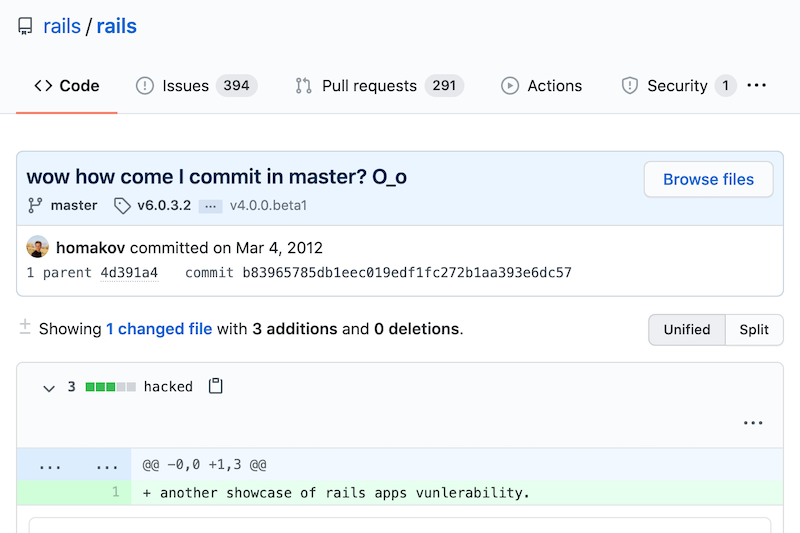

# API6:2019
---
## Mass Assignment

-----

## Mass Assignment

> Binding client provided data (e.g., JSON) to data models, without proper properties filtering based on a whitelist, usually lead to Mass Assignment. Either guessing objects properties, exploring other API endpoints, reading the documentation, or providing additional object properties in request payloads, allows attackers to modify object properties they are not supposed to.

-----

## In other words...

- Attackers use developer conveniences against us
  - Observe data returned in `GET` requests
  - Identify sensitive data that shouldn't be modified by regular users
- Types of properties include
  - Permissions (`isAdmin`)
  - Biz logic (`accountBalance`)
  - Internal (`createdBy`)
- `PUT` and `PATCH` most vulnerable
  - `POST` can still be abused

-----

## Implications

- Bypass security
- Privilege escalation
- Data tampering

-----

## Just ask Harbor...
#### September 2019

> Harbor is an open source registry that secures artifacts with policies and role-based access control, ensures images are scanned and free from vulnerabilities, and signs images as trusted.

user.go:317 `if err := ua.DecodeJSONReq(&user); err != nil `

`{"username":"test","email":"test123@gmai.com","realname":"no name","password":"Password1\u0021″,"comment":null}`

`{"username":"test",...,"has_admin_role":true}`

-----

## Just ask Github...
#### March 2012

-----

## Just ask Github
#### March 2012

> I simply added a \
> `<input value=USER_ID name=public_key[user_id]>` \
> field to Public key update form, \
> where USER_ID = 4223

https://homakov.blogspot.com/2012/03/how-to.html

-----

## Prevention

- Don't automatically bind request body to entities
- Create _allow lists_ of client modifiable properties
- Build & use schemas for input validation