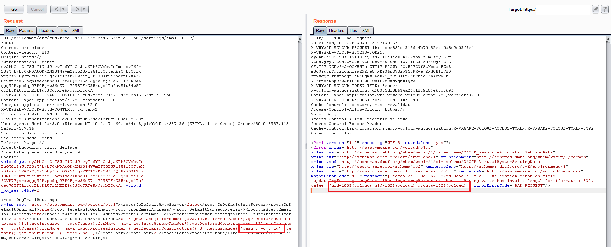

# API8:2019
---
## Injection

-----

## Injection

> Injection flaws, such as SQL, NoSQL, Command Injection, etc., occur when untrusted data is sent to an interpreter as part of a command or query. The attacker’s malicious data can trick the interpreter into executing unintended commands or accessing data without proper authorization.

-----

## In other words...

<!-- Little Bobby Tables -->

-----

## In other words...

- Any time client input isn't...
  - validated
  - filtered
  - sanitized
- Especially when passed straight to...
  - databases 
  - OS
  - parsers (particularly XML)
- Applies to _external systems_ too
  - Integration endpoints that dump data straight to database

-----

## Implications

- Information disclosure
- Denial of service
- Host takeover

-----

## Just ask Starbucks...
#### May 2020

Injection exposes internal Microsoft Graph database

```
GET /bff/proxy/stream/v1/users/me/streamItems/web\..\.\..\.\..\.\..\.\..\.\..\.\search\v1\Accounts\ HTTP/1.1
Host: app.starbucks.com
```

```
{
  "@odata.context": "https://redacted.starbucks.com/Search/v1/$metadata#Accounts",
  "value": [
    {
      "Id": 1,
      "ExternalId": "12345",
      "UserName": "UserName",
      "FirstName": "FirstName",
      "LastName": "LastName",
      "EmailAddress": "0640DE@example.com",
      "Submarket": "US",
      "PartnerNumber": null,
      "RegistrationDate": "1900-01-01T00:00:00Z",
      "RegistrationSource": "iOSApp",
      "LastUpdated": "2017-06-01T15:32:56.4925207Z"
    },
...
lots of production accounts
```

> Our current proof of concept demonstrated we could access the names, emails, phone numbers, and addresses of nearly 100 million Starbucks customers.

https://samcurry.net/hacking-starbucks/

-----

## Just ask VMware...
#### April 2020

Cloud Director - RCE

Able to inject code via email settings
- SMTP server hostname: `${7*7}`
- Error: `String value has invalid format, value: [49]`

-----

## Just ask VMware...
#### April 2020

Using Java's reflection abilities, able to run shell commands



-----

## Prevention

- All external data is...
  - validated
  - filtered
  - sanitized
- Use safe, parameterized interfaces
- Limits on number, type of records returned
