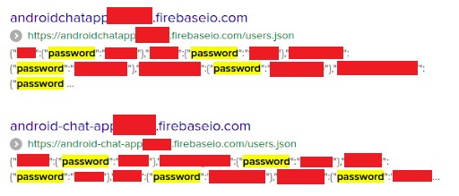

# API9:2019
---
## Improper Assets Management

-----

## Improper Assets Management

> APIs tend to expose more endpoints than traditional web applications, making proper and updated documentation highly important. Proper hosts and deployed API versions inventory also play an important role to mitigate issues such as deprecated API versions and exposed debug endpoints.

-----

## In other words...

- Old APIs still deployed
  - Missing code fixes
- Non-production (beta) APIs
  - Missing protection mechanisms
- Poor documentation and communication
  - Devs don't know v1 is still running
  - Ops don't know v1 can be retired

-----

## Implications

- Access sensitive data
- Account takeover

-----

## Just ask Airtel...
#### December 2019

India's #3 mobile network operator
(325 million subscribers)

Unsecured test environment API gave access to...
- Name
- Gender
- Date of Birth
- Address
- Device IMEI number

> “There was a technical issue in one of our testing APIs, which was addressed as soon as it was brought to our notice,” an Airtel spokesperson told the BBC.

https://ehraz.co/security/casestudy/airtel/

-----

## Just ask lots of Firebase developers...

> 4.8 percent of mobile apps using Google Firebase to store user data are not properly secured, allowing anyone to access databases containing users’ personal information, access tokens, and other data without a password or any other authentication.

https://www.comparitech.com/blog/information-security/firebase-misconfiguration-report/

-----

## Prevention

- API inventory
  - Hosts
  - Environments
  - Network access
  - Deployed versions
- Protect every exposed API
  - Web Application Firewall (WAF)
  - Rate limiting
  - Proper auth
- Double-check older versions when deploying new fixes
  - Back-port critical changes if possible
  - Decommision older versions otherwise